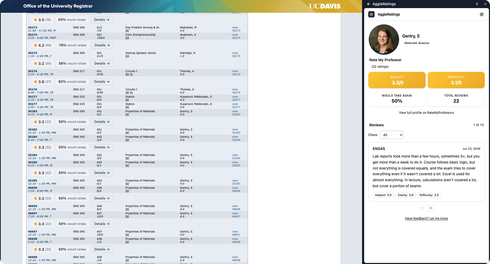
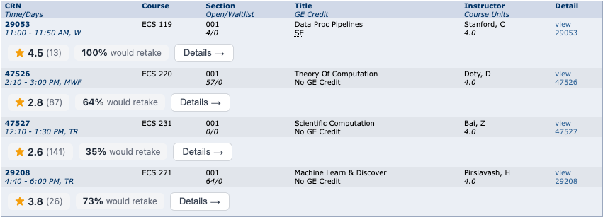

<div align="center">


# AggieRatings

Rate My Professors ratings, shown right where you browse UC Davis courses in the Class Search Tool.

[](LICENSE)
[](https://github.com/IvanKuria/aggie-ratings/releases)
[](https://developer.chrome.com/docs/extensions/mv3/intro/)
[](https://wxt.dev)

</div>

## Overview

AggieRatings is a Chrome extension for UC Davis students. It pulls Rate My Professors ratings directly into the UC Davis Class Search Tool, so you can size up a class without leaving the page or juggling browser tabs.

It works on UC Davis's public Class Search Tool — no login required — so you can browse and compare instructors before you ever sign in to register.

## Screenshots

Ratings appear directly under each class in the Class Search Tool results — the
professor's Rate My Professors score, review count, and would-take-again
percentage — and clicking **Details** opens the full profile in the side panel:
headshot, quality, difficulty, would-take-again, top tags, and student reviews.



Inline ratings under every section:



## Features

- **Inline ratings.** Every section in the Class Search Tool results gets a rating bar showing the professor's Rate My Professors score, review count, and would-take-again percentage.
- **Professor profiles.** Click "Details" to open a side panel with the full Rate My Professors profile: quality, difficulty, would-take-again, top tags, and recent reviews.
- **Professor photos.** Best-effort headshots pulled from UC Davis departmental faculty pages, with a clean initials avatar fallback when none is found.
- **Smart matching.** Multi-strategy name matching resolves the instructor shown on the page against the right RMP professor at UC Davis.
- **Fast.** Lazy-loaded modules and one-week caching keep repeat visits instant.
- **Privacy first.** All cached data is stored locally. No analytics, no tracking, no data collection.

## How It Works

Open the UC Davis [Class Search Tool](https://registrar-apps.ucdavis.edu/courses/search/index.cfm), pick a term, and run a search. AggieRatings detects each class section and renders an inline rating bar beneath it:

```
★ 4.4 (33)    85% would take again    Details ->
```

Click **Details** to open the side panel with the full professor profile, including Rate My Professors quality, difficulty, would-take-again, top tags, and recent reviews.

> The Class Search Tool is publicly accessible at
> `registrar-apps.ucdavis.edu/courses/search/index.cfm` without signing in, so AggieRatings works for prospective students and during open browsing — not just inside registration.

## Install

> Not yet on the Chrome Web Store. Manual install for now:

1. Clone or download this repo.
2. Run `npm install && npm run build`.
3. Open `chrome://extensions/` and enable **Developer mode**.
4. Click **Load unpacked** and select the `.output/chrome-mv3` folder.

## Tech Stack

| Layer | Technology |
|-------|-----------|
| Framework | [WXT](https://wxt.dev) (Vite-based extension framework) |
| UI | React 18, Tailwind CSS, [shadcn/ui](https://ui.shadcn.com) |
| Animation | [Framer Motion](https://motion.dev) |
| Search | [Fuse.js](https://fusejs.io) (fuzzy name matching) |
| APIs | Rate My Professors GraphQL |
| Extension | Chrome Manifest V3, Side Panel API |

## Development

```bash
git clone https://github.com/IvanKuria/aggie-ratings.git
cd aggie-ratings
npm install
npm run dev
```

Then load `.output/chrome-mv3-dev` as an unpacked extension in Chrome.

## Architecture

UC Davis's Class Search Tool is a ColdFusion app that renders search results into a table after you run a search. Rather than intercept any network traffic, AggieRatings watches the page for results and parses the rendered table.

```
Content script                         Background SW              Side Panel
--------------                         ------------              ----------
Observe #courseResultsDiv          ->  Fetch RMP (GraphQL)   ->  Professor profile
Parse instructor + course per row      Match best professor      Top tags
Inject rating bar per section          Cache in storage          Reviews carousel
Open side panel on "Details"
```

- **Content script** uses a `MutationObserver` to watch the results container (`#courseResultsDiv`). When results render, it parses each result row from the results table to read the instructor and course, then injects the inline rating bar.
- **Background service worker** handles Rate My Professors GraphQL calls, name matching, and caching.
- **Side panel** displays the full professor profile — quality, difficulty, would-take-again, top tags, and reviews — when "Details" is clicked.

## Privacy

- All cached data is stored locally in `chrome.storage.local`.
- No analytics or telemetry.
- Network requests go to `ratemyprofessors.com` (ratings) and public
  `*.ucdavis.edu` departmental pages (headshots) — only a professor's name or
  course code is ever sent, never anything about you.
- Permissions are scoped to `registrar-apps.ucdavis.edu`,
  `www.ratemyprofessors.com`, and `*.ucdavis.edu`.

## Credits

Adapted from [Rate My Slugs](https://github.com/IvanKuria/rate-my-slugs) (UC Santa Cruz).

## License

MIT. See [LICENSE](LICENSE) for details.
